```{=html}
<div class="hero" style="background-image:url('images/cover_banner.jpg');">
  <div class="hero__inner">
    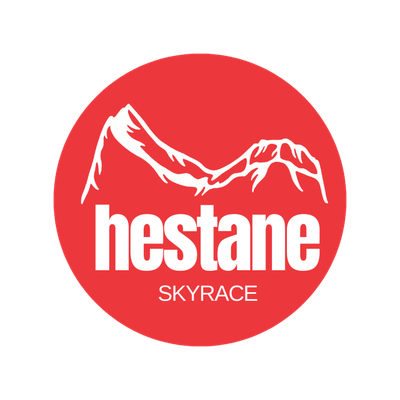
    <div class="hero__kicker">11. juli 2026 · Sunnfjord</div>
    <h1 class="hero__title">Hestane Skyrace <span class="year">2026</span></h1>
    <div class="hero__sub">På tur over det devonske fjellbeltet</div>
    <div class="hero__meta">
      <span>🏔️ Storehesten &amp; Lisjehesten</span>
      <span>📍 Langeland skisenter, Bygstad</span>
      <span>🏃 32 &amp; 26 km</span>
    </div>
    <a href="https://www.racedays.run/event/hestane-skyrace-2026/register" class="hero__cta">Meld deg på</a>
  </div>
</div>
```

Velkomen til aller første utgåva av **Hestane Skyrace**! Her får du springe over dei spektakulære toppane Storehesten og Lisjehesten i Bygstad. Vi lagar i stand ein løpsfest og ein aktiv dag for heile familien, med løp for alle som vil bli med.

::: {.callout-tip appearance="simple"}
**Denne nettsida er deltakarguiden din.** Her finn du alt du treng å vite før, under og etter løpet. Bruk menyen øvst, eller hopp rett til [løypa](loype.qmd), [programmet](program.qmd), [utstyr & reglar](utstyr.qmd) eller [praktisk info](praktisk.qmd).
:::

```{=html}
<div class="factgrid">
  <div class="factcard"><div class="num">32</div><span class="lbl">km Storerunda</span></div>
  <div class="factcard"><div class="num">~1800</div><span class="lbl">høgdemeter</span></div>
  <div class="factcard"><div class="num">26</div><span class="lbl">km Lisjerunda</span></div>
  <div class="factcard"><div class="num">09:00</div><span class="lbl">start</span></div>
</div>
```

## To rundar — vel din

```{=html}
<div class="routes">
  <div class="route">
    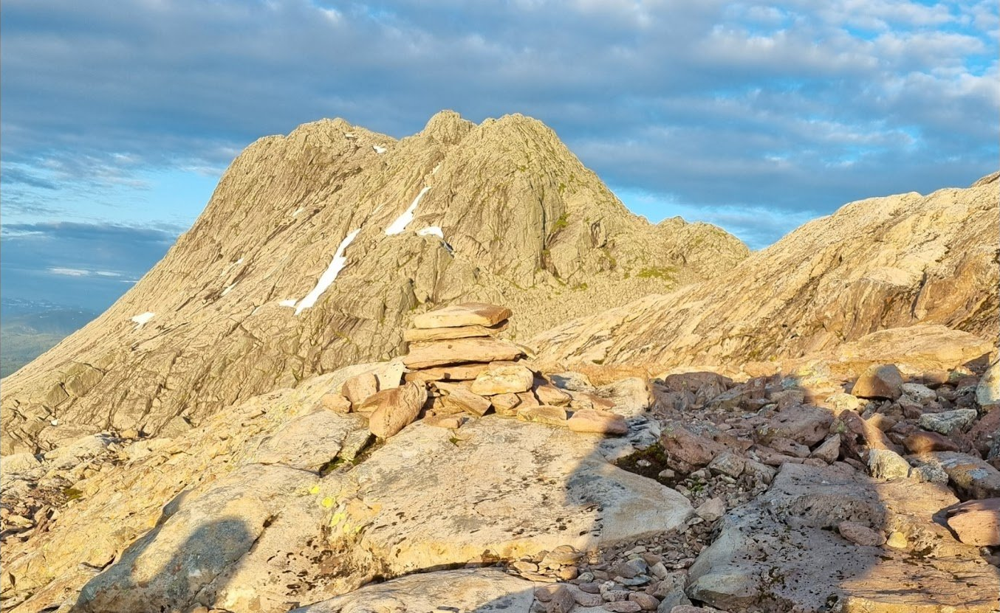
    <div class="route__body">
      <h3>Storerunda</h3>
      <div class="route__stats">
        <div><b>32 km</b><small>distanse</small></div>
        <div><b>~1800 m</b><small>stigning</small></div>
      </div>
      <p>Over begge toppane — Storehesten og Lisjehesten. Det fulle skyrace-eventyret med teknisk klatring, eksponert egg og storslått panorama. <a href="loype.html">Sjå løypa →</a></p>
    </div>
  </div>
  <div class="route">
    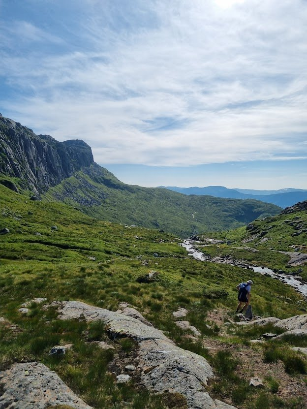
    <div class="route__body">
      <h3>Lisjerunda</h3>
      <div class="route__stats">
        <div><b>26 km</b><small>distanse</small></div>
        <div><b>~1200 m</b><small>stigning</small></div>
      </div>
      <p>Kun over Lisjehesten. Eit godt val for deg som ønskjer ei kortare, men framleis krevjande, fjellrunde i mektig natur. <a href="loype.html">Sjå løypa →</a></p>
    </div>
  </div>
</div>
```

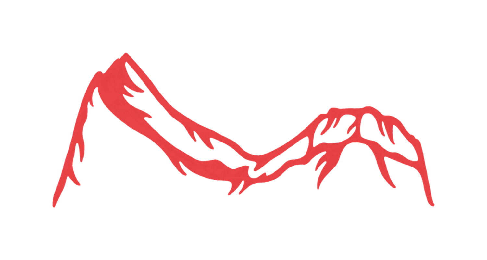{.silhouette-divider}

## I korte trekk

::: tldr
### Det viktigaste på éin plass

- 📆 **Laurdag 11. juli 2026**, start kl. 09:00 frå Langeland skisenter
- 🏔️ **Storerunda 32 km** (~1800 hm) eller **Lisjerunda 26 km** (~1200 hm)
- 🎒 Hugs **obligatorisk utstyr** — mobil, 1 L drikke, nødrasjon, vindjakke ([sjå lista](utstyr.qmd))
- ⚠️ **Cutoff Skaraly kl. 15:30**, siste målgang kl. 19:00
- 🅿️ Parkering på Langeland — kr 90 for dagen
- 🍖 Mat i mål 12:30–17:00, **afterrun på Tønna kl. 20:00**
- 📞 Arrangør: Lars **948 27 438** / Torstein **416 53 315**
:::

## Kvifor delta?

- 💪 **Ei meistringsoppleving for alle** — både for dei som vil konkurrere og dei som har som mål å fullføre.
- 🌄 **Spektakulær natur** over det devonske fjellbeltet, no også med UNESCO-status.
- 👨‍👩‍👧‍👦 **Aktivitetar for heile familien** — barne- og ungdomsløp, mat og afterrun.

```{=html}
<figure class="solo-fig">
  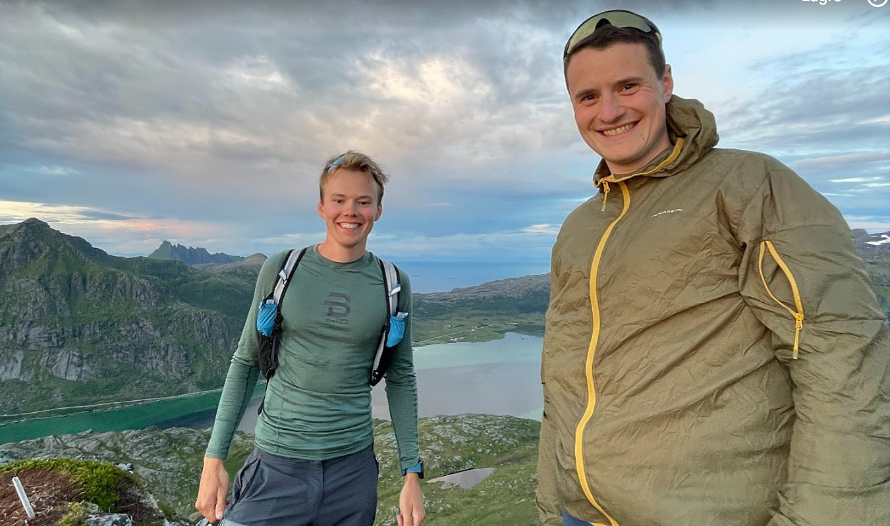
  <figcaption>Arrangørane Lars og Torstein.</figcaption>
</figure>
```

## Om arrangørane

Vi som arrangerer er to lokale sunnfjordingar frå Bygstad — **Lars Øvrebø** og **Torstein Bolstad Blikra**. Vi har vakse opp med fjella og skiløypene i bygda, og ønskjer no å gi fleire høve til å oppleve gleda ved å springe i Sunnfjords mektige natur. Saman med oss har vi idrettslaget **Gaular IL** i ryggen.

::: {.callout-note title="Klar for start?"}
Påmelding skjer via [Racedays](https://www.racedays.run/event/hestane-skyrace-2026). Følg oss på [Instagram \@hestaneskyrace](https://instagram.com/hestaneskyrace) for siste oppdateringar om løypetrasé og praktiske detaljar.
:::

## 📸 Bilete frå løpet

```{=html}
<div class="photo-cta">
  <div class="photo-cta__inner">
    <div class="photo-cta__icon">📷</div>
    <div class="photo-cta__text">
      <h3>Alle bileta frå Hestane Skyrace 2026 ligg her</h3>
      <p>Last ned, del og bruk fritt — vi håpar de likte dagen like godt som vi gjorde!</p>
    </div>
    <a href="https://drive.google.com/drive/folders/1RJYAB32v9MWjwIa660ivyHKvt1l5ksig?usp=drive_link" target="_blank" rel="noopener" class="photo-cta__btn">
      Sjå alle bileta →
    </a>
  </div>
</div>
```

```{=html}
<div class="sponsorband">
  <h2 class="sponsorband__title">Våre sponsorar</h2>

  <div class="sponsorband__main">
    <a href="https://www.fjordanecaravan.no/" target="_blank" rel="noopener" class="sponsor-card sponsor-card--main">
      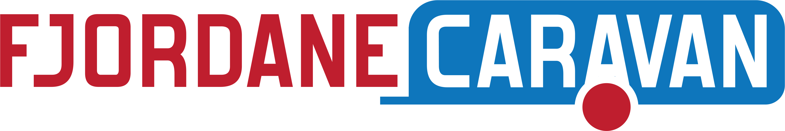
    </a>
    
    <a href="https://www.lettsauna.no/" target="_blank" rel="noopener" class="sponsor-card sponsor-card--main">
      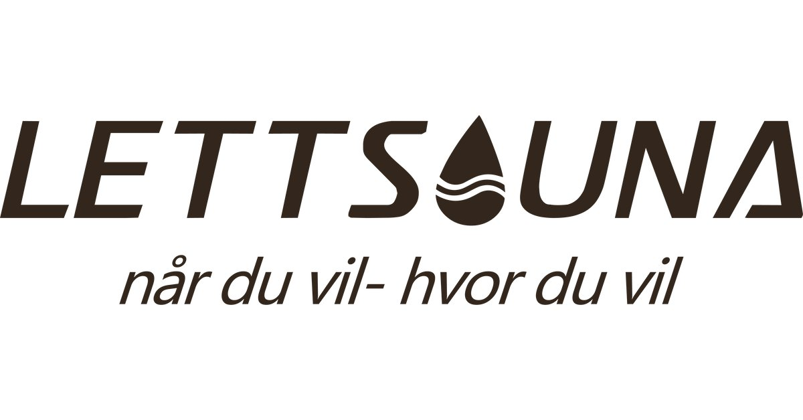
    </a>
  </div>

  <div class="sponsorband__rest">
    <a href="https://www.sparebank1.no/nn/sogn-fjordane/privat.html" target="_blank" rel="noopener" class="sponsor-card">
      
    </a>
    <a href="#" target="_blank" rel="noopener" class="sponsor-card">
      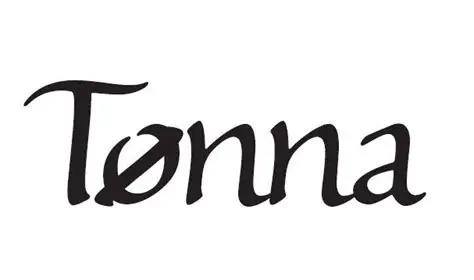
    </a>
    <a href="https://www.fylkesadvokat.no/" target="_blank" rel="noopener" class="sponsor-card">
      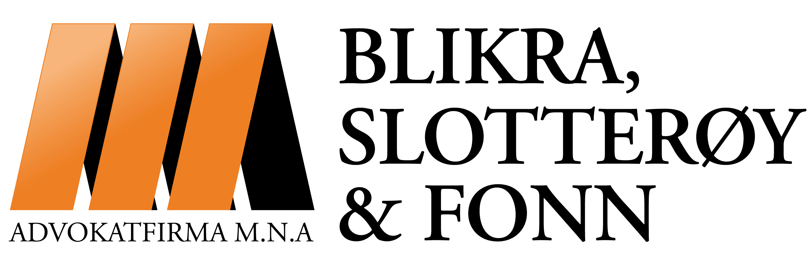
    </a>
    <a href="https://www.stravent.no/" target="_blank" rel="noopener" class="sponsor-card">
      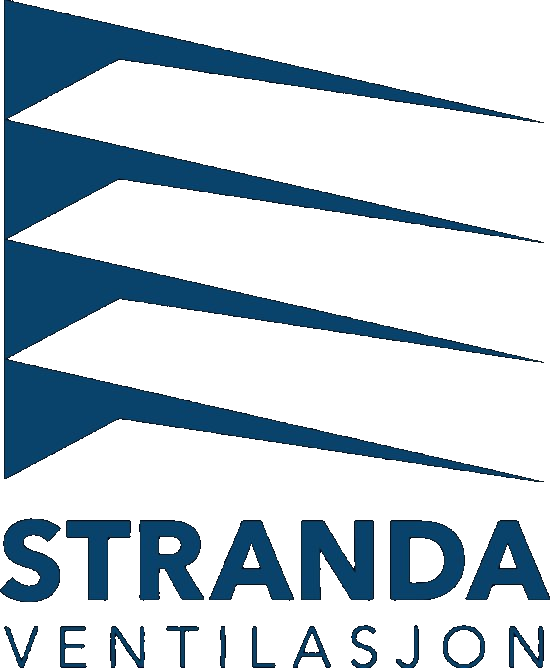
    </a>
    <a href="https://rkontor.no/" target="_blank" rel="noopener" class="sponsor-card">
      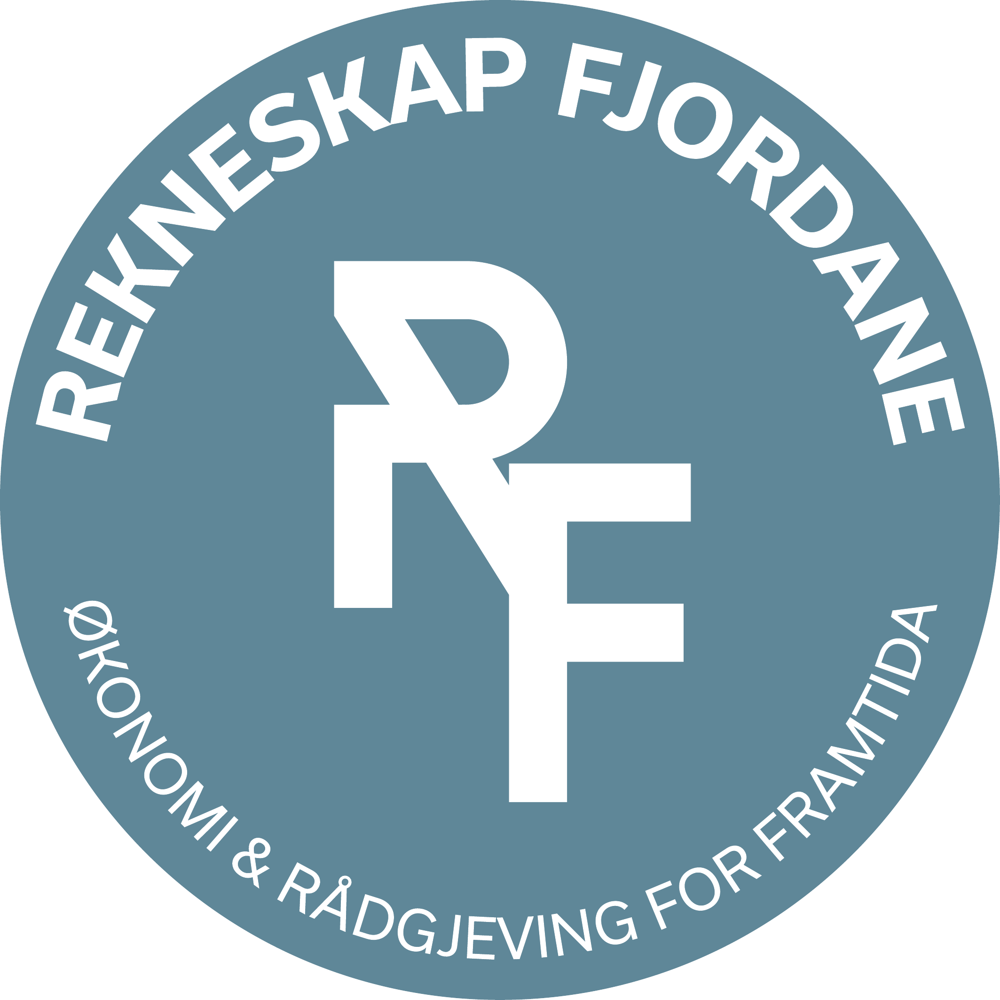
    </a>
  </div>
</div>
```
