::: {.sectionbanner style="background-image:url('images/banner_loype.jpg');"}
# Løypa

:::


Løypa startar og går i mål ved **Langeland skisenter**.

```{=html}
<div class="routes">
  <div class="route">
    <div class="route__body">
      <h3>Storerunda</h3>
      <div class="route__stats">
        <div><b>32 km</b><small>distanse</small></div>
        <div><b>~1800 m</b><small>stigning</small></div>
      </div>
      <p>Går over <b>både</b> Storehesten og Lisjehesten. Det fulle eventyret.</p>
    </div>
  </div>
  <div class="route">
    <div class="route__body">
      <h3>Lisjerunda</h3>
      <div class="route__stats">
        <div><b>26 km</b><small>distanse</small></div>
        <div><b>~1200 m</b><small>stigning</small></div>
      </div>
      <p>Går <b>kun</b> over Lisjehesten. Vender ned mot Kvamsstølen ved Skaraly.</p>
    </div>
  </div>
</div>
```

## Traséen i hovudtrekk

1. Start ved Langeland skisenter — inn på den gamle postvegen mot flyplassen.
2. Gjennom Djupedalen til Hjelmelandsstølen og Yndestadsstølen.
3. Bratt motbakke opp mot Lisjehesten — her klyv ein opp skaret ved hjelp av **tau**. **Viktig** at her er det kun ein person i tauet om gongen så vis hensyn til kvarandre.  
4. Langs ryggen mot Skaraly. 
5. Frå Skaraly: *(Lisjerunda vender her tilbake og ned mot Kvamsstølen.)* den mest krevjande stigninga opp egga på austsida av **Storehesten**. Svært bratt stigning der ein ikkje må gå for langt mot venstre.
6. På toppen: panoramautsikt med havet i vest og Jostedalsbreen i aust.
7. Nedstigning i ura på vestsida, vidare langs T-merka sti tilbake til Skaraly og mot stølane.
8. Siste etappe i skiløypa gjennom myr og traktorvegterreng, før ein returnerar til djupedalen og spring samme veg tilbake som starten.
9. Målgang på oppløpet på stadion.


## Drikkestasjonar og vassfylling

Det er drikkestasjonar undervegs, men det er òg gode moglegheiter til å fylle på med naturleg vatn enkelte stader i løypa. Oversikta under viser kor du finn dei — bruk ho til å planlegge eige vassforbruk.

| Distanse | Stad | Merknad |
|---|---|---|
| **~6 km** | Hjelmelandsstølen | Første drikkestasjon. Sjølv om du ikkje er tom, er det lurt å fylle opp her — det er lite naturleg vatn å fylle frå før Lisjehesten. |
| **~11,5 km** | Lisjehesten | Naturleg vatn ved toppen. |
| **~15 km** | Skaraly | Stasjon der det er venta at **alle bør fylle drikke**. Her vender Lisjerunda tilbake og ned mot Kvamsstølen, mens Storerunda fortset over Storehesten — ei lengre runde utan naturleg vatn før Grunnevatnet. |
| **~20 km** *(kun Storerunda)* | Grunnevatnet | Naturleg vatn, like før du kjem tilbake til Skaraly. |
| **~21 km** *(kun Storerunda)* | Skaraly | Ny påfyllsmoglegheit på veg tilbake. |
| **~27 km** | Hjelmelandsstølen | Siste drikkestasjon før mål. |

: {.striped tbl-colwidths="[15,25,60]"}


## Kart og GPX

GPX-filer for begge rundene ligg på [løpssida hos Racedays](https://www.racedays.run/event/hestane-skyrace-2026). Last ned og legg inn på klokka di på førehand.

## Alternative løyper

Vêr og tilhøve i fjellet kan gjere det nødvendig å leggje om løypa. Endeleg avgjerd blir sendt på e-post til alle påmelde **seinast kl. 07:00 på løpsdagen**. Dersom ingen e-post er sendt, går løpet som normalt (alternativ 1).

Me tilrår at du lastar ned GPX-filene for alle alternativa på førehand og legg dei inn på klokka di, slik at du er klar uansett kva alternativ som blir valt.

### Storerunda

```{=html}
<div class="alt-routes">

  <div class="alt-route">
    <div class="alt-route__header">
      <span class="alt-route__badge">Alternativ 1</span>
      <span class="alt-route__tag alt-route__tag--normal">Normal løype</span>
    </div>
    <div class="alt-route__stats">
      <span>32 km</span><span>~1800 hm</span>
    </div>
    <p>Ordinær løype over Lisjehesten og Storehesten — opp Egga, ned ura på vestsida.</p>
    <a href="gpx/Storerunda_alternativ_1.gpx" download class="alt-route__gpx">⬇ Last ned GPX — Storerunda alternativ 1</a>
    <div id="map_s1" class="gpx-map"></div>
<script>
(function(){
  var pts=[[61.39431,5.80477],[61.39454,5.80139],[61.39454,5.79686],[61.394,5.79061],[61.39328,5.78609],[61.395,5.78069],[61.39483,5.77795],[61.39416,5.77506],[61.39373,5.77041],[61.39411,5.76657],[61.39347,5.76394],[61.39262,5.7593],[61.39177,5.75322],[61.39119,5.75119],[61.39154,5.74949],[61.39318,5.74851],[61.39445,5.7479],[61.3953,5.74737],[61.39658,5.74771],[61.39741,5.74829],[61.39841,5.74982],[61.39945,5.74762],[61.40192,5.74384],[61.40311,5.74078],[61.40361,5.73735],[61.4045,5.73582],[61.40525,5.73297],[61.40547,5.73123],[61.40578,5.72815],[61.4059,5.72575],[61.40558,5.72344],[61.40548,5.72235],[61.40556,5.72065],[61.40538,5.71878],[61.40509,5.71637],[61.40441,5.71311],[61.40373,5.70995],[61.40286,5.70638],[61.40306,5.70258],[61.4011,5.70042],[61.40099,5.69672],[61.40113,5.69234],[61.40033,5.68889],[61.40016,5.68588],[61.40009,5.68228],[61.40112,5.67933],[61.40265,5.68044],[61.40458,5.68257],[61.40571,5.68304],[61.40703,5.68453],[61.40917,5.68721],[61.41116,5.68415],[61.41178,5.68122],[61.41197,5.67834],[61.4118,5.67942],[61.41117,5.68102],[61.41035,5.68243],[61.40961,5.68249],[61.40926,5.68064],[61.40927,5.67958],[61.40982,5.67658],[61.41026,5.67547],[61.41056,5.67154],[61.41103,5.66919],[61.41139,5.66693],[61.41151,5.66475],[61.41191,5.66225],[61.41188,5.66129],[61.41136,5.65992],[61.41076,5.65877],[61.41108,5.65732],[61.41117,5.65436],[61.41101,5.65244],[61.41048,5.6521],[61.40963,5.65378],[61.40915,5.65395],[61.40869,5.65537],[61.40809,5.65486],[61.40768,5.65362],[61.40727,5.65299],[61.40631,5.65293],[61.40587,5.65334],[61.40552,5.65157],[61.40536,5.64997],[61.40461,5.65003],[61.4038,5.65006],[61.40331,5.6475],[61.40295,5.64696],[61.40231,5.64632],[61.40197,5.64521],[61.40147,5.64436],[61.40103,5.64305],[61.40063,5.64146],[61.40036,5.64047],[61.40065,5.63769],[61.40099,5.63484],[61.40136,5.62953],[61.40139,5.62737],[61.40122,5.62532],[61.40037,5.62267],[61.40062,5.62056],[61.40105,5.61887],[61.40169,5.61462],[61.40193,5.61392],[61.40259,5.61287],[61.40319,5.61267],[61.40387,5.61312],[61.40468,5.61506],[61.4053,5.61738],[61.40557,5.61877],[61.40648,5.61817],[61.40765,5.61827],[61.40836,5.62041],[61.40892,5.62266],[61.40889,5.62554],[61.4085,5.62911],[61.40819,5.63132],[61.40736,5.63201],[61.40643,5.63322],[61.40653,5.63643],[61.40641,5.63882],[61.40665,5.64283],[61.40636,5.64604],[61.40598,5.64795],[61.40536,5.64997],[61.40466,5.64995],[61.40538,5.6499],[61.40556,5.65179],[61.40591,5.65339],[61.40605,5.65309],[61.40672,5.65312],[61.40748,5.65335],[61.40784,5.6541],[61.40812,5.65558],[61.40825,5.65683],[61.40859,5.65945],[61.40831,5.66059],[61.40792,5.66122],[61.40657,5.66375],[61.40519,5.66471],[61.40436,5.6642],[61.40359,5.66431],[61.4021,5.66376],[61.40178,5.667],[61.40177,5.67331],[61.40091,5.68109],[61.4001,5.68302],[61.40016,5.68865],[61.40138,5.69421],[61.40144,5.70073],[61.40286,5.70615],[61.40426,5.71223],[61.4051,5.7163],[61.40537,5.72305],[61.40578,5.72909],[61.40471,5.73546],[61.40241,5.742],[61.40005,5.74684],[61.39917,5.75006],[61.39761,5.74891],[61.39693,5.74863],[61.39553,5.74711],[61.39457,5.74722],[61.39388,5.7487],[61.39229,5.74937],[61.39084,5.74858],[61.39157,5.75194],[61.39235,5.75728],[61.39302,5.76219],[61.39414,5.76525],[61.39408,5.76899],[61.39419,5.77352],[61.39444,5.77699],[61.39551,5.77897],[61.3944,5.78442],[61.39356,5.78762],[61.39419,5.79371],[61.39537,5.80169],[61.3972,5.8067],[61.39844,5.80964]];
  var m=L.map('map_s1',{zoomControl:true,scrollWheelZoom:false});
  L.tileLayer('https://{s}.tile.opentopomap.org/{z}/{x}/{y}.png',{maxZoom:17,attribution:'© <a href="https://opentopomap.org">OpenTopoMap</a>'}).addTo(m);
  var line=L.polyline(pts,{color:'#ec383c',weight:4,opacity:.9}).addTo(m);
  m.fitBounds(line.getBounds(),{padding:[16,16]});
  L.circleMarker(pts[0],{radius:8,color:'#fff',fillColor:'#22c55e',fillOpacity:1,weight:2.5}).bindTooltip('Start / Mål',{permanent:false}).addTo(m);
})();
</script>
  </div>

  <div class="alt-route">
    <div class="alt-route__header">
      <span class="alt-route__badge">Alternativ 2</span>
      <span class="alt-route__tag alt-route__tag--weather">Dårleg vær — Egga</span>
    </div>
    <div class="alt-route__stats">
      <span>34 km</span><span>~1820 hm</span>
    </div>
    <p>Vert brukt ved dårleg vær og glatt i Egga. Løypa går tur-retur Storehesten på stien ein normalt spring ned (vestsida). Merk: ved svært dårleg sikt kan løypevakt gi beskjed om at ein snur før toppen av Storehesten.</p>
    <a href="gpx/Storerunda_alternativ_2.gpx" download class="alt-route__gpx">⬇ Last ned GPX — Storerunda alternativ 2</a>
    <div id="map_s2" class="gpx-map"></div>
<script>
(function(){
  var pts=[[61.39431,5.80477],[61.39454,5.80139],[61.39454,5.79686],[61.394,5.79061],[61.39328,5.78609],[61.395,5.78069],[61.39483,5.77795],[61.39416,5.77506],[61.39373,5.77041],[61.39411,5.76657],[61.39347,5.76394],[61.39262,5.7593],[61.39177,5.75322],[61.39119,5.75119],[61.39154,5.74949],[61.39318,5.74851],[61.39445,5.7479],[61.3953,5.74737],[61.39658,5.74771],[61.39741,5.74829],[61.39841,5.74982],[61.39945,5.74762],[61.40192,5.74384],[61.40311,5.74078],[61.40361,5.73735],[61.4045,5.73582],[61.40525,5.73297],[61.40547,5.73123],[61.40578,5.72815],[61.4059,5.72575],[61.40558,5.72344],[61.40548,5.72235],[61.40556,5.72065],[61.40538,5.71878],[61.40509,5.71637],[61.40441,5.71311],[61.40373,5.70995],[61.40286,5.70638],[61.40306,5.70258],[61.4011,5.70042],[61.40099,5.69672],[61.40113,5.69234],[61.40033,5.68889],[61.40016,5.68588],[61.40009,5.68228],[61.40112,5.67933],[61.40265,5.68044],[61.40458,5.68257],[61.40571,5.68304],[61.40703,5.68453],[61.40917,5.68721],[61.41116,5.68415],[61.41178,5.68122],[61.41197,5.67834],[61.4118,5.67942],[61.41117,5.68102],[61.41035,5.68243],[61.40961,5.68249],[61.40926,5.68064],[61.40927,5.67958],[61.40982,5.67658],[61.41026,5.67547],[61.41056,5.67154],[61.41103,5.66919],[61.41139,5.66693],[61.41151,5.66475],[61.41191,5.66225],[61.41188,5.66129],[61.41136,5.65992],[61.41076,5.65877],[61.41108,5.65732],[61.41117,5.65436],[61.41101,5.65244],[61.41048,5.6521],[61.40963,5.65378],[61.40915,5.65395],[61.40869,5.65537],[61.40809,5.65486],[61.40768,5.65362],[61.40727,5.65299],[61.40631,5.65293],[61.40587,5.65334],[61.40552,5.65157],[61.40549,5.64959],[61.40624,5.64711],[61.40673,5.64476],[61.40646,5.64214],[61.40645,5.63797],[61.40626,5.63519],[61.40659,5.63261],[61.40769,5.63201],[61.40832,5.63066],[61.40865,5.62829],[61.40893,5.62468],[61.40892,5.62266],[61.40836,5.62041],[61.40765,5.61827],[61.40648,5.61817],[61.40557,5.61877],[61.4053,5.61738],[61.40468,5.61506],[61.40387,5.61312],[61.40319,5.61267],[61.4024,5.61311],[61.40185,5.61429],[61.40094,5.61838],[61.40065,5.62043],[61.40012,5.62209],[61.40071,5.62424],[61.40128,5.62631],[61.40128,5.62631],[61.40071,5.62424],[61.40064,5.62071],[61.40097,5.61923],[61.40152,5.61507],[61.4019,5.61393],[61.40252,5.613],[61.40312,5.61272],[61.40382,5.61304],[61.40458,5.61489],[61.40528,5.6172],[61.40553,5.61866],[61.40631,5.6184],[61.40754,5.61819],[61.40832,5.62021],[61.40896,5.62231],[61.40887,5.62506],[61.40861,5.62875],[61.40827,5.63099],[61.40762,5.63204],[61.40655,5.63283],[61.40647,5.63597],[61.40643,5.63869],[61.40659,5.64268],[61.40646,5.64585],[61.40603,5.64778],[61.40553,5.6504],[61.40562,5.65277],[61.40598,5.65377],[61.40617,5.6529],[61.40716,5.65304],[61.40759,5.65334],[61.40799,5.65455],[61.40821,5.65565],[61.40828,5.65771],[61.40859,5.65979],[61.40826,5.66081],[61.4077,5.66174],[61.40636,5.66385],[61.40505,5.66485],[61.40415,5.66414],[61.40312,5.66425],[61.40199,5.66476],[61.40162,5.66861],[61.40164,5.67563],[61.40068,5.68185],[61.39999,5.68363],[61.40065,5.68948],[61.40101,5.69685],[61.40245,5.70085],[61.40339,5.70778],[61.40437,5.7133],[61.40539,5.71719],[61.40584,5.72481],[61.40557,5.73079],[61.40382,5.73653],[61.4019,5.7439],[61.39944,5.74767],[61.3986,5.74994],[61.39748,5.74845],[61.39677,5.74851],[61.39539,5.74732],[61.39448,5.74749],[61.39329,5.7485],[61.3916,5.74949],[61.39106,5.75023],[61.39171,5.75283],[61.39251,5.75883],[61.39325,5.76308],[61.39416,5.76612],[61.39379,5.76975],[61.39419,5.77454],[61.39473,5.7777],[61.39527,5.77974],[61.39374,5.78561],[61.3939,5.78982],[61.39448,5.79584],[61.39601,5.80304],[61.39789,5.80783],[61.39815,5.80984]];
  var m=L.map('map_s2',{zoomControl:true,scrollWheelZoom:false});
  L.tileLayer('https://{s}.tile.opentopomap.org/{z}/{x}/{y}.png',{maxZoom:17,attribution:'© <a href="https://opentopomap.org">OpenTopoMap</a>'}).addTo(m);
  var line=L.polyline(pts,{color:'#ec383c',weight:4,opacity:.9}).addTo(m);
  m.fitBounds(line.getBounds(),{padding:[16,16]});
  L.circleMarker(pts[0],{radius:8,color:'#fff',fillColor:'#22c55e',fillOpacity:1,weight:2.5}).bindTooltip('Start / Mål',{permanent:false}).addTo(m);
})();
</script>
  </div>

  <div class="alt-route">
    <div class="alt-route__header">
      <span class="alt-route__badge">Alternativ 3</span>
      <span class="alt-route__tag alt-route__tag--water">Mykje vatn — utan skaret og Egga</span>
    </div>
    <div class="alt-route__stats">
      <span>36 km</span><span>~1880 hm</span>
    </div>
    <p>Vert brukt når elva i skaret er for stor til å passere trygt. Løypa følgjer alternativ sti på sørsida nedafor ryggen til Lisjehesten, tur-retur Lisjehesten på ned-stien, og tur-retur Storehesten via vestsida (utan Egga).</p>
    <a href="gpx/Storerunda_alternativ_3.gpx" download class="alt-route__gpx">⬇ Last ned GPX — Storerunda alternativ 3</a>
    <div id="map_s3" class="gpx-map"></div>
<script>
(function(){
  var pts=[[61.39431,5.80477],[61.39454,5.80139],[61.39454,5.79686],[61.394,5.79061],[61.39328,5.7861],[61.3948,5.78263],[61.39541,5.77855],[61.3942,5.77673],[61.39409,5.77259],[61.39418,5.76823],[61.394,5.76482],[61.39306,5.7608],[61.39215,5.75581],[61.39133,5.75184],[61.39114,5.74892],[61.39262,5.74909],[61.39423,5.74864],[61.39479,5.74723],[61.39603,5.74723],[61.3971,5.74843],[61.398,5.74931],[61.39935,5.74984],[61.40063,5.74527],[61.4023,5.74251],[61.40349,5.73916],[61.40408,5.73614],[61.40508,5.73387],[61.40542,5.73201],[61.40577,5.72927],[61.40602,5.72661],[61.40575,5.72437],[61.4054,5.72288],[61.40553,5.72104],[61.40547,5.71987],[61.40536,5.7173],[61.40494,5.7142],[61.40395,5.7108],[61.40318,5.7071],[61.40307,5.70439],[61.40198,5.70085],[61.40092,5.69785],[61.40142,5.69361],[61.40084,5.69024],[61.40002,5.6868],[61.39999,5.68343],[61.40068,5.68185],[61.40188,5.67876],[61.4032,5.67514],[61.40578,5.67524],[61.40771,5.66986],[61.4087,5.66306],[61.40858,5.65989],[61.4084,5.65818],[61.40829,5.65619],[61.40802,5.65516],[61.40865,5.65549],[61.40904,5.65392],[61.40958,5.65395],[61.4104,5.65206],[61.41093,5.65253],[61.41115,5.65421],[61.41109,5.65725],[61.41089,5.65872],[61.41127,5.65968],[61.41188,5.66129],[61.41191,5.66225],[61.41151,5.66475],[61.41139,5.66693],[61.41103,5.66919],[61.41056,5.67154],[61.41026,5.67547],[61.40982,5.67658],[61.40927,5.67958],[61.40926,5.68064],[61.4094,5.68012],[61.40934,5.67848],[61.41001,5.67648],[61.41049,5.67364],[61.41073,5.66995],[61.41119,5.66858],[61.41133,5.66608],[61.41172,5.66326],[61.41199,5.66207],[61.41162,5.6607],[61.41084,5.65939],[61.41099,5.65838],[61.41113,5.65559],[61.41116,5.65356],[61.41071,5.6524],[61.40997,5.65245],[61.40947,5.65396],[61.40875,5.65418],[61.40836,5.65515],[61.40781,5.6538],[61.40743,5.65313],[61.40651,5.65313],[61.406,5.65319],[61.40587,5.65334],[61.40552,5.65157],[61.40549,5.64959],[61.40624,5.64711],[61.40673,5.64476],[61.40646,5.64214],[61.40645,5.63797],[61.40626,5.63519],[61.40659,5.63261],[61.40769,5.63201],[61.40832,5.63066],[61.40865,5.62829],[61.40889,5.62554],[61.40892,5.62266],[61.40836,5.62041],[61.40765,5.61827],[61.40648,5.61817],[61.40557,5.61877],[61.4053,5.61738],[61.40468,5.61506],[61.40387,5.61312],[61.40319,5.61267],[61.4024,5.61311],[61.40185,5.61429],[61.40094,5.61838],[61.40065,5.62043],[61.40048,5.62323],[61.40128,5.6255],[61.40142,5.62721],[61.40119,5.62516],[61.40036,5.62228],[61.40065,5.62043],[61.40094,5.61838],[61.40168,5.61452],[61.40197,5.61385],[61.40261,5.61279],[61.4033,5.61254],[61.40388,5.61325],[61.40481,5.61581],[61.40535,5.61753],[61.40567,5.61889],[61.40654,5.61816],[61.40772,5.61843],[61.40843,5.6205],[61.40894,5.62277],[61.40896,5.62596],[61.4084,5.62937],[61.40807,5.63155],[61.40722,5.63216],[61.40621,5.6337],[61.40652,5.63662],[61.40645,5.63905],[61.40676,5.6432],[61.40633,5.64626],[61.40592,5.64827],[61.4055,5.65077],[61.40579,5.65295],[61.4061,5.65305],[61.40688,5.65314],[61.4075,5.65336],[61.40792,5.65427],[61.40815,5.65559],[61.4083,5.65708],[61.40853,5.6592],[61.40835,5.66058],[61.40798,5.6612],[61.40683,5.66356],[61.40519,5.66471],[61.40436,5.6642],[61.40359,5.66431],[61.40214,5.66381],[61.40178,5.667],[61.40177,5.67331],[61.40091,5.68109],[61.4001,5.68302],[61.40016,5.68865],[61.40138,5.69421],[61.40144,5.70073],[61.40286,5.70615],[61.40426,5.71223],[61.4051,5.7163],[61.40537,5.72305],[61.40556,5.73037],[61.40414,5.73615],[61.40244,5.74202],[61.40127,5.74472],[61.39956,5.74921],[61.39828,5.7497],[61.39736,5.74826],[61.39646,5.74751],[61.39517,5.74739],[61.39442,5.74808],[61.39288,5.74869],[61.39148,5.74946],[61.39121,5.75154],[61.39185,5.75409],[61.39281,5.75999],[61.39376,5.76467],[61.39415,5.76708],[61.39376,5.77092],[61.39408,5.77586],[61.39505,5.7783],[61.3949,5.78166],[61.39387,5.78511],[61.3939,5.78982],[61.39448,5.79584],[61.39601,5.80304],[61.39789,5.80783],[61.39769,5.81009]];
  var m=L.map('map_s3',{zoomControl:true,scrollWheelZoom:false});
  L.tileLayer('https://{s}.tile.opentopomap.org/{z}/{x}/{y}.png',{maxZoom:17,attribution:'© <a href="https://opentopomap.org">OpenTopoMap</a>'}).addTo(m);
  var line=L.polyline(pts,{color:'#ec383c',weight:4,opacity:.9}).addTo(m);
  m.fitBounds(line.getBounds(),{padding:[16,16]});
  L.circleMarker(pts[0],{radius:8,color:'#fff',fillColor:'#22c55e',fillOpacity:1,weight:2.5}).bindTooltip('Start / Mål',{permanent:false}).addTo(m);
})();
</script>
  </div>

  <div class="alt-route">
    <div class="alt-route__header">
      <span class="alt-route__badge">Alternativ 4</span>
      <span class="alt-route__tag alt-route__tag--water">Mykje vatn — utan skaret, normal Egga</span>
    </div>
    <div class="alt-route__stats">
      <span>32,5 km</span><span>~1530 hm</span>
    </div>
    <p>Same omlegging som alternativ 3 for Lisjehesten (utan skaret), men Storehesten blir gått opp Egga som normalt.</p>
    <a href="gpx/Storerunda_alternativ_4.gpx" download class="alt-route__gpx">⬇ Last ned GPX — Storerunda alternativ 4</a>
    <div id="map_s4" class="gpx-map"></div>
<script>
(function(){
  var pts=[[61.39431,5.80477],[61.39454,5.80139],[61.39454,5.79686],[61.394,5.79061],[61.39328,5.7861],[61.3948,5.78263],[61.39541,5.77855],[61.3942,5.77673],[61.39409,5.77259],[61.39418,5.76823],[61.394,5.76482],[61.39306,5.7608],[61.39215,5.75581],[61.39133,5.75184],[61.39114,5.74892],[61.39262,5.74909],[61.39423,5.74864],[61.39479,5.74723],[61.39603,5.74723],[61.3971,5.74843],[61.398,5.74931],[61.39935,5.74984],[61.40063,5.74527],[61.4023,5.74251],[61.40349,5.73916],[61.40408,5.73614],[61.40508,5.73387],[61.40542,5.73201],[61.40577,5.72927],[61.40602,5.72661],[61.40575,5.72437],[61.4054,5.72288],[61.40553,5.72104],[61.40547,5.71987],[61.40536,5.7173],[61.40494,5.7142],[61.40395,5.7108],[61.40318,5.7071],[61.40307,5.70439],[61.40198,5.70085],[61.40092,5.69785],[61.40142,5.69361],[61.40084,5.69024],[61.40002,5.6868],[61.39999,5.68343],[61.40068,5.68185],[61.40188,5.67876],[61.4032,5.67514],[61.40578,5.67524],[61.40771,5.66986],[61.4087,5.66306],[61.40858,5.65989],[61.4084,5.65818],[61.40829,5.65619],[61.40802,5.65516],[61.40865,5.65549],[61.40904,5.65392],[61.40958,5.65395],[61.4104,5.65206],[61.41093,5.65253],[61.41115,5.65421],[61.41109,5.65725],[61.41089,5.65872],[61.41127,5.65968],[61.41188,5.66129],[61.41191,5.66225],[61.41151,5.66475],[61.41139,5.66693],[61.41103,5.66919],[61.41056,5.67154],[61.41026,5.67547],[61.40982,5.67658],[61.40927,5.67958],[61.40926,5.68064],[61.4094,5.68012],[61.40934,5.67848],[61.41001,5.67648],[61.41049,5.67364],[61.41073,5.66995],[61.41119,5.66858],[61.41133,5.66608],[61.41172,5.66326],[61.41199,5.66207],[61.41162,5.6607],[61.41084,5.65939],[61.41099,5.65838],[61.41113,5.65559],[61.41116,5.65356],[61.41071,5.6524],[61.40997,5.65245],[61.40947,5.65396],[61.40875,5.65418],[61.40836,5.65515],[61.40781,5.6538],[61.40743,5.65313],[61.40651,5.65313],[61.406,5.65319],[61.40587,5.65334],[61.40552,5.65157],[61.40549,5.64959],[61.40624,5.64711],[61.40673,5.64476],[61.40646,5.64214],[61.40645,5.63797],[61.40626,5.63519],[61.40659,5.63261],[61.40769,5.63201],[61.40832,5.63066],[61.40865,5.62829],[61.40889,5.62554],[61.40892,5.62266],[61.40836,5.62041],[61.40765,5.61827],[61.40819,5.61977],[61.40891,5.62174],[61.40893,5.62468],[61.40865,5.62829],[61.40832,5.63066],[61.40769,5.63201],[61.40659,5.63261],[61.40626,5.63519],[61.40645,5.63797],[61.40646,5.64214],[61.40653,5.64541],[61.40609,5.64765],[61.40541,5.64984],[61.40556,5.65239],[61.40596,5.65336],[61.40642,5.65308],[61.40741,5.6531],[61.40779,5.65374],[61.40808,5.65527],[61.40829,5.65631],[61.40843,5.65828],[61.40859,5.65999],[61.40817,5.66105],[61.40742,5.66304],[61.40583,5.66446],[61.40458,5.66445],[61.40389,5.66391],[61.40246,5.66406],[61.40191,5.66565],[61.40185,5.67046],[61.40126,5.67874],[61.40034,5.6823],[61.40018,5.68525],[61.40112,5.69218],[61.40094,5.6995],[61.40293,5.70296],[61.40404,5.71033],[61.4051,5.71403],[61.40555,5.71995],[61.40582,5.72749],[61.4052,5.73357],[61.4032,5.7405],[61.40185,5.744],[61.39955,5.74695],[61.39896,5.75006],[61.39753,5.74874],[61.39685,5.74864],[61.39547,5.74724],[61.39451,5.74732],[61.39357,5.74863],[61.3921,5.74935],[61.39092,5.74928],[61.39165,5.75204],[61.39248,5.75822],[61.3931,5.76256],[61.39416,5.76541],[61.39392,5.76937],[61.3942,5.77392],[61.39452,5.77707],[61.39549,5.7791],[61.39439,5.78465],[61.39347,5.78711],[61.39406,5.79263],[61.39518,5.80084],[61.39708,5.80644],[61.39892,5.80934]];
  var m=L.map('map_s4',{zoomControl:true,scrollWheelZoom:false});
  L.tileLayer('https://{s}.tile.opentopomap.org/{z}/{x}/{y}.png',{maxZoom:17,attribution:'© <a href="https://opentopomap.org">OpenTopoMap</a>'}).addTo(m);
  var line=L.polyline(pts,{color:'#ec383c',weight:4,opacity:.9}).addTo(m);
  m.fitBounds(line.getBounds(),{padding:[16,16]});
  L.circleMarker(pts[0],{radius:8,color:'#fff',fillColor:'#22c55e',fillOpacity:1,weight:2.5}).bindTooltip('Start / Mål',{permanent:false}).addTo(m);
})();
</script>
  </div>

</div>
```

### Lisjerunda

```{=html}
<div class="alt-routes">

  <div class="alt-route">
    <div class="alt-route__header">
      <span class="alt-route__badge">Alternativ 1</span>
      <span class="alt-route__tag alt-route__tag--normal">Normal løype</span>
    </div>
    <div class="alt-route__stats">
      <span>26 km</span><span>~1200 hm</span>
    </div>
    <p>Ordinær løype over Lisjehesten — opp skaret med tau, ned mot Kvamsstølen via Skaraly.</p>
    <a href="gpx/Lisjerunda_alternativ_1.gpx" download class="alt-route__gpx">⬇ Last ned GPX — Lisjerunda alternativ 1</a>
    <div id="map_l1" class="gpx-map"></div>
<script>
(function(){
  var pts=[[61.39431,5.80477],[61.39454,5.80139],[61.39454,5.79686],[61.394,5.79061],[61.39328,5.78609],[61.395,5.78069],[61.39483,5.77795],[61.39416,5.77506],[61.39373,5.77041],[61.39411,5.76657],[61.39347,5.76394],[61.39262,5.7593],[61.39177,5.75322],[61.39119,5.75119],[61.39154,5.74949],[61.39318,5.74851],[61.39445,5.7479],[61.3953,5.74737],[61.39658,5.74771],[61.39741,5.74829],[61.39841,5.74982],[61.39945,5.74762],[61.40192,5.74384],[61.40311,5.74078],[61.40361,5.73735],[61.4045,5.73582],[61.40525,5.73297],[61.40547,5.73123],[61.40578,5.72815],[61.4059,5.72575],[61.40558,5.72344],[61.40548,5.72235],[61.40556,5.72065],[61.40538,5.71878],[61.40509,5.71637],[61.40441,5.71311],[61.40373,5.70995],[61.40286,5.70638],[61.40306,5.70258],[61.4011,5.70042],[61.40099,5.69672],[61.40113,5.69234],[61.40033,5.68889],[61.40016,5.68588],[61.40009,5.68228],[61.40112,5.67933],[61.40265,5.68044],[61.40458,5.68257],[61.40571,5.68304],[61.40703,5.68453],[61.40917,5.68721],[61.41116,5.68415],[61.41178,5.68122],[61.41197,5.67834],[61.4118,5.67942],[61.41117,5.68102],[61.41035,5.68243],[61.40961,5.68249],[61.40926,5.68064],[61.40927,5.67958],[61.40982,5.67658],[61.41026,5.67547],[61.41056,5.67154],[61.41103,5.66919],[61.41139,5.66693],[61.41151,5.66475],[61.41191,5.66225],[61.41188,5.66129],[61.41136,5.65992],[61.41076,5.65877],[61.41108,5.65732],[61.41117,5.65436],[61.41101,5.65244],[61.41048,5.6521],[61.40963,5.65378],[61.40915,5.65395],[61.40869,5.65537],[61.40809,5.65486],[61.40768,5.65362],[61.40727,5.65299],[61.40631,5.65293],[61.40595,5.65361],[61.4061,5.65305],[61.40688,5.65314],[61.4075,5.65336],[61.40792,5.65427],[61.40815,5.65559],[61.4083,5.65708],[61.40858,5.65959],[61.40828,5.66065],[61.40785,5.66131],[61.40637,5.66384],[61.40508,5.6648],[61.40432,5.66416],[61.40334,5.66438],[61.40201,5.66364],[61.40181,5.66777],[61.40169,5.6747],[61.40077,5.68124],[61.4,5.68345],[61.40042,5.6889],[61.40121,5.6956],[61.40195,5.70079],[61.40312,5.7071],[61.4043,5.71288],[61.4053,5.71684],[61.4057,5.72376],[61.40556,5.73037],[61.40425,5.73617],[61.4021,5.74337],[61.39955,5.74693],[61.39896,5.75006],[61.39753,5.74874],[61.39685,5.74864],[61.39547,5.74724],[61.39451,5.74732],[61.39357,5.74863],[61.3921,5.74935],[61.39092,5.74928],[61.39165,5.75204],[61.39248,5.75822],[61.3931,5.76256],[61.39416,5.76541],[61.39392,5.76937],[61.3942,5.77392],[61.39452,5.77707],[61.39549,5.7791],[61.39386,5.78516],[61.39376,5.78919],[61.39437,5.79474],[61.39567,5.80242],[61.39768,5.80746],[61.39819,5.80987]];
  var m=L.map('map_l1',{zoomControl:true,scrollWheelZoom:false});
  L.tileLayer('https://{s}.tile.opentopomap.org/{z}/{x}/{y}.png',{maxZoom:17,attribution:'© <a href="https://opentopomap.org">OpenTopoMap</a>'}).addTo(m);
  var line=L.polyline(pts,{color:'#3b82f6',weight:4,opacity:.9}).addTo(m);
  m.fitBounds(line.getBounds(),{padding:[16,16]});
  L.circleMarker(pts[0],{radius:8,color:'#fff',fillColor:'#22c55e',fillOpacity:1,weight:2.5}).bindTooltip('Start / Mål',{permanent:false}).addTo(m);
})();
</script>
  </div>

  <div class="alt-route">
    <div class="alt-route__header">
      <span class="alt-route__badge">Alternativ 2</span>
      <span class="alt-route__tag alt-route__tag--water">Mykje vatn — utan skaret</span>
    </div>
    <div class="alt-route__stats">
      <span>28 km</span><span>~1270 hm</span>
    </div>
    <p>Vert brukt når elva i skaret er for stor. Løypa følgjer alternativ sti på sørsida nedafor ryggen til Lisjehesten og går tur-retur på stien ein normalt spring ned. Ca. 2 km lenger enn normalt.</p>
    <a href="gpx/Lisjerunda_alternativ_2.gpx" download class="alt-route__gpx">⬇ Last ned GPX — Lisjerunda alternativ 2</a>
    <div id="map_l2" class="gpx-map"></div>
<script>
(function(){
  var pts=[[61.39431,5.80477],[61.39454,5.80139],[61.39454,5.79686],[61.394,5.79061],[61.39328,5.7861],[61.3948,5.78263],[61.39541,5.77855],[61.3942,5.77673],[61.39409,5.77259],[61.39418,5.76823],[61.394,5.76482],[61.39306,5.7608],[61.39215,5.75581],[61.39133,5.75184],[61.39114,5.74892],[61.39262,5.74909],[61.39423,5.74864],[61.39479,5.74723],[61.39603,5.74723],[61.3971,5.74843],[61.398,5.74931],[61.39935,5.74984],[61.40063,5.74527],[61.4023,5.74251],[61.40349,5.73916],[61.40408,5.73614],[61.40508,5.73387],[61.40542,5.73201],[61.40577,5.72927],[61.40602,5.72661],[61.40575,5.72437],[61.4054,5.72288],[61.40553,5.72104],[61.40547,5.71987],[61.40536,5.7173],[61.40494,5.7142],[61.40395,5.7108],[61.40318,5.7071],[61.40307,5.70439],[61.40198,5.70085],[61.40092,5.69785],[61.40142,5.69361],[61.40084,5.69024],[61.40002,5.6868],[61.39999,5.68343],[61.40068,5.68185],[61.40188,5.67876],[61.4032,5.67514],[61.40578,5.67524],[61.40771,5.66986],[61.4087,5.66306],[61.40858,5.65989],[61.4084,5.65818],[61.40829,5.65619],[61.40802,5.65516],[61.40865,5.65549],[61.40904,5.65392],[61.40958,5.65395],[61.4104,5.65206],[61.41093,5.65253],[61.41115,5.65421],[61.41109,5.65725],[61.41089,5.65872],[61.41127,5.65968],[61.41188,5.66129],[61.41191,5.66225],[61.41151,5.66475],[61.41139,5.66693],[61.41103,5.66919],[61.41056,5.67154],[61.41026,5.67547],[61.40982,5.67658],[61.40927,5.67958],[61.40926,5.68064],[61.4094,5.68012],[61.40934,5.67848],[61.41001,5.67648],[61.41049,5.67364],[61.41073,5.66995],[61.41119,5.66858],[61.41133,5.66608],[61.41172,5.66326],[61.41199,5.66207],[61.41162,5.6607],[61.41084,5.65939],[61.41099,5.65838],[61.41113,5.65559],[61.41116,5.65356],[61.41071,5.6524],[61.40997,5.65245],[61.40947,5.65396],[61.40875,5.65418],[61.40836,5.65515],[61.40781,5.6538],[61.40743,5.65313],[61.40651,5.65313],[61.406,5.65319],[61.40596,5.65336],[61.40642,5.65308],[61.40741,5.6531],[61.40779,5.65374],[61.40808,5.65527],[61.40829,5.65631],[61.40843,5.65828],[61.40859,5.65979],[61.40826,5.66081],[61.4077,5.66174],[61.40629,5.66389],[61.40481,5.66479],[61.40408,5.6641],[61.40294,5.66426],[61.40191,5.66491],[61.4016,5.66904],[61.40161,5.67737],[61.40054,5.68218],[61.40008,5.68389],[61.40087,5.69054],[61.40099,5.69754],[61.40269,5.70162],[61.40355,5.70906],[61.40453,5.71351],[61.40534,5.71802],[61.40598,5.72586],[61.40542,5.73208],[61.40352,5.7392],[61.40216,5.74343],[61.40038,5.74619],[61.39928,5.74998],[61.39785,5.74912],[61.397,5.74858],[61.3956,5.74705],[61.39468,5.74721],[61.39417,5.7486],[61.39239,5.74932],[61.39098,5.74868],[61.39143,5.75191],[61.39223,5.75675],[61.39301,5.762],[61.39406,5.76492],[61.39414,5.76877],[61.39417,5.77322],[61.39431,5.77693],[61.39551,5.77877],[61.39446,5.78389],[61.39337,5.7867],[61.394,5.79113],[61.39473,5.79835],[61.39667,5.80471],[61.39853,5.80867]];
  var m=L.map('map_l2',{zoomControl:true,scrollWheelZoom:false});
  L.tileLayer('https://{s}.tile.opentopomap.org/{z}/{x}/{y}.png',{maxZoom:17,attribution:'© <a href="https://opentopomap.org">OpenTopoMap</a>'}).addTo(m);
  var line=L.polyline(pts,{color:'#3b82f6',weight:4,opacity:.9}).addTo(m);
  m.fitBounds(line.getBounds(),{padding:[16,16]});
  L.circleMarker(pts[0],{radius:8,color:'#fff',fillColor:'#22c55e',fillOpacity:1,weight:2.5}).bindTooltip('Start / Mål',{permanent:false}).addTo(m);
})();
</script>
  </div>

</div>
```

## Slik ser løypa ut

Følg løypa steg for steg — frå start på Langeland, opp over begge toppane og tilbake.

```{=html}
<figure class="loype-fig">
  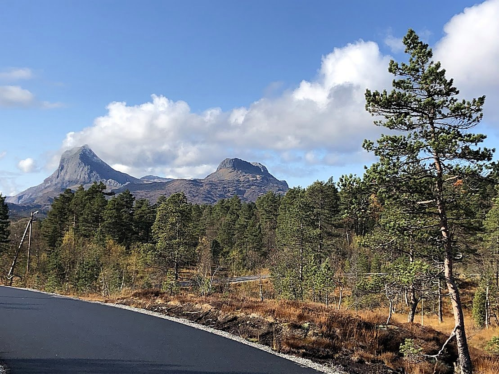
  <figcaption class="loype-caption"><span class="loype-step">1</span> Frå startstreken ved Langeland — Storehesten og Lisjehesten ruvar i bakgrunnen.</figcaption>
</figure>

<figure class="loype-fig">
  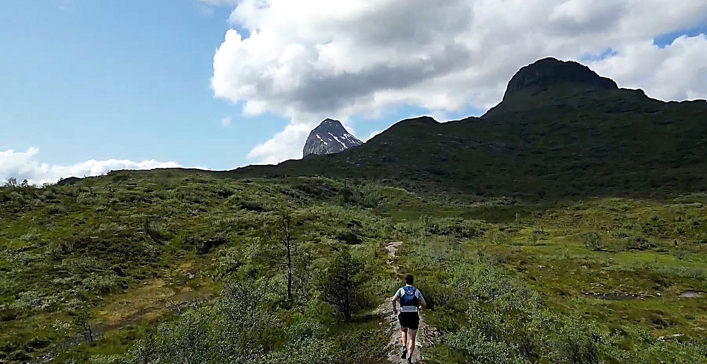
  <figcaption class="loype-caption"><span class="loype-step">2</span> På veg mellom Hjelmelandsstølen og Yndestadsstølen.</figcaption>
</figure>

<figure class="loype-fig">
  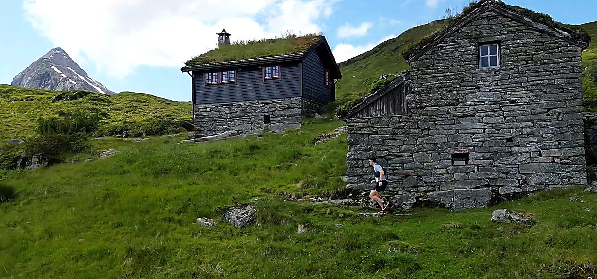
  <figcaption class="loype-caption"><span class="loype-step">3</span> På Yndestadsstølen.</figcaption>
</figure>

<figure class="loype-fig">
  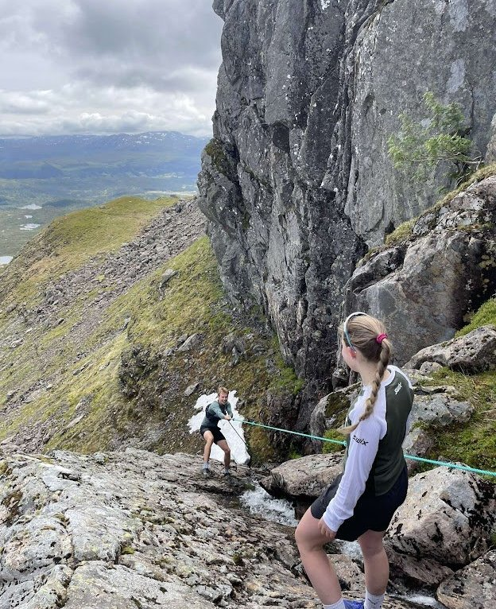
  <figcaption class="loype-caption"><span class="loype-step">4</span> Skaret opp til Lisjehesten — eit krevjande parti kor ein må vise hensyn til kvarandre i tau.</figcaption>
</figure>

<figure class="loype-fig">
  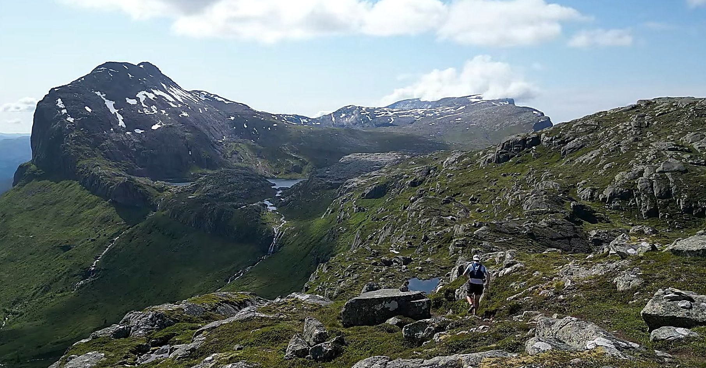
  <figcaption class="loype-caption"><span class="loype-step">5</span> På veg ned frå toppen av Lisjehesten.</figcaption>
</figure>

<figure class="loype-fig">
  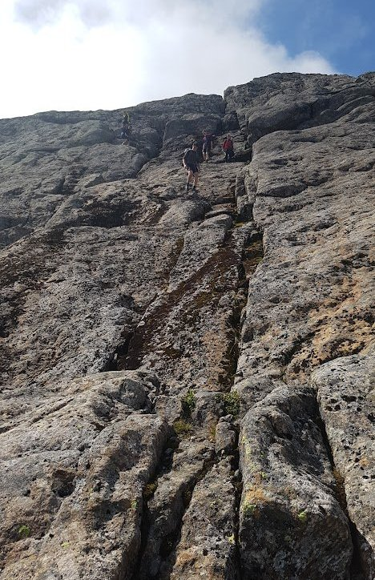
  <figcaption class="loype-caption"><span class="loype-step">6</span> Den vanskeligste delen av den bratte Egga opp til Storehesten.</figcaption>
</figure>

<figure class="loype-fig">
  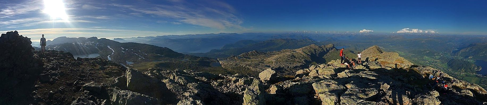
  <figcaption class="loype-caption"><span class="loype-step">7</span> Panoramautsikt frå toppen av Storehesten over nordaust.</figcaption>
</figure>

<figure class="loype-fig">
  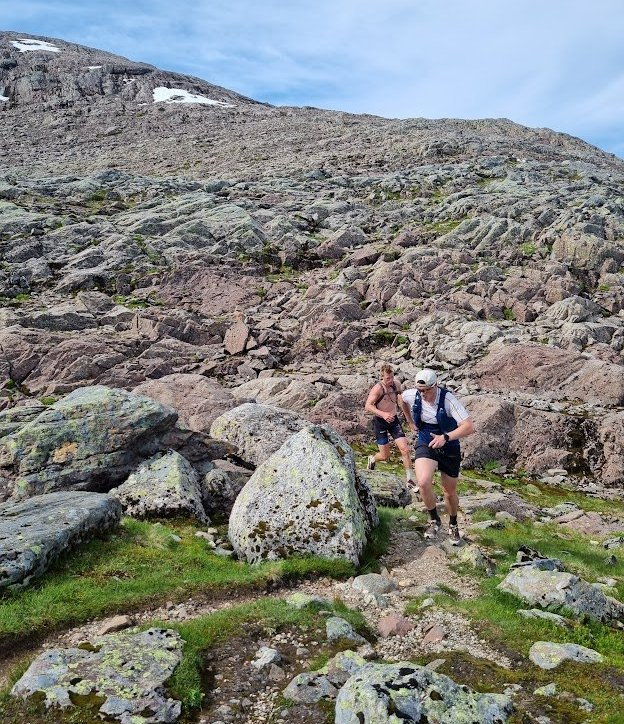
  <figcaption class="loype-caption"><span class="loype-step">8</span> Ura og nedstigninga frå Storehesten.</figcaption>
</figure>

<figure class="loype-fig">
  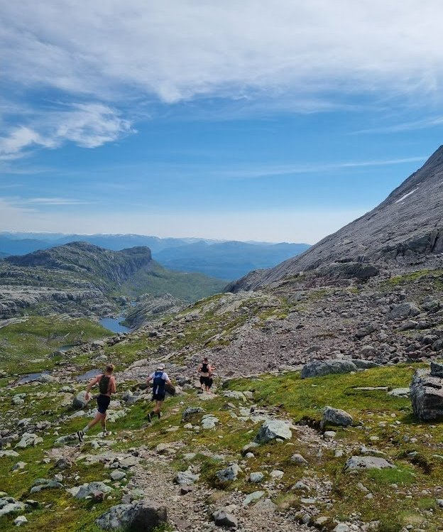
  <figcaption class="loype-caption"><span class="loype-step">9</span> Ned mot baksida av Storehesten og tilbake til Skaraly på god sti.</figcaption>
</figure>

<figure class="loype-fig">
  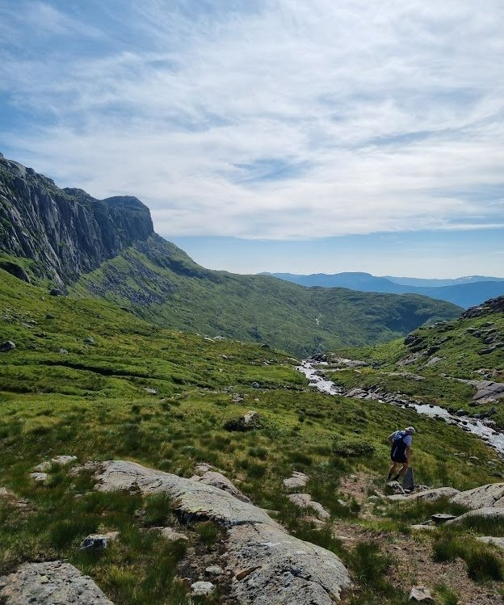
  <figcaption class="loype-caption"><span class="loype-step">10</span> Ned mot Kvamsstølen.</figcaption>
</figure>

<figure class="loype-fig">
  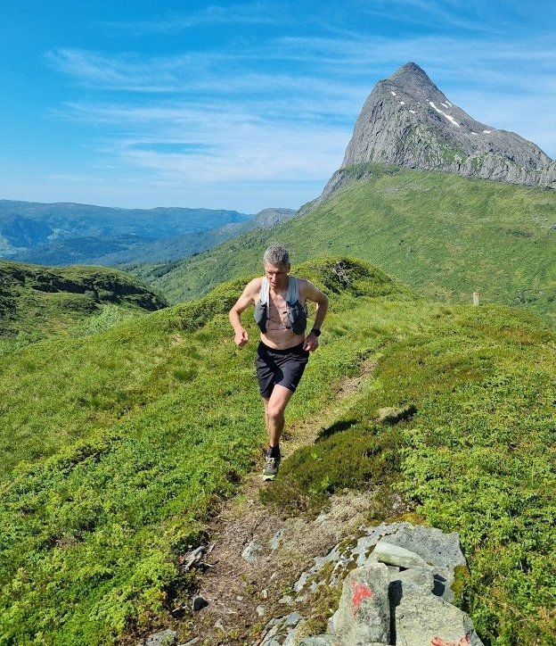
  <figcaption class="loype-caption"><span class="loype-step">11</span> Mellom Kvamsstølen og Yndestadsstølen — på veg tilbake.</figcaption>
</figure>
```


```{=html}
<div class="sponsorband">
  <h2 class="sponsorband__title">Våre sponsorar</h2>

  <div class="sponsorband__main">
    <a href="https://www.fjordanecaravan.no/" target="_blank" rel="noopener" class="sponsor-card sponsor-card--main">
      
    </a>
    
    <a href="https://www.lettsauna.no/" target="_blank" rel="noopener" class="sponsor-card sponsor-card--main">
      
    </a>
  </div>

  <div class="sponsorband__rest">
    <a href="https://www.sparebank1.no/nn/sogn-fjordane/privat.html" target="_blank" rel="noopener" class="sponsor-card">
      
    </a>
    <a href="#" target="_blank" rel="noopener" class="sponsor-card">
      
    </a>
    <a href="https://www.fylkesadvokat.no/" target="_blank" rel="noopener" class="sponsor-card">
      
    </a>
    <a href="https://www.stravent.no/" target="_blank" rel="noopener" class="sponsor-card">
      
    </a>
    <a href="https://rkontor.no/" target="_blank" rel="noopener" class="sponsor-card">
      
    </a>
  </div>
</div>
```
