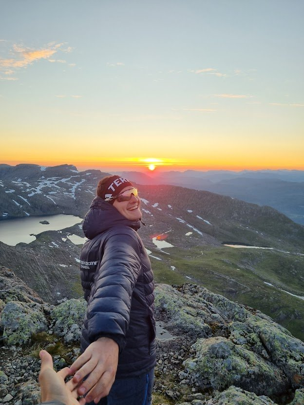

::: {.sectionbanner style="background-image:url('images/banner_program_ny.jpg');"}
# Program
:::

::: guidebadge
Oversik over dagen
:::

Heile dagen, laurdag **11. juli 2026**, på Langeland skisenter.

## Tidsplan

| Tid | Program |
|-----|---------|
| **07:00** | Dagen opnar — sekretariat og startnummerutdeling |
| **07:00–09:00** | Tidleg start tilgjengeleg — for dei som ønskjer meir tid på løypa |
| **08:40** | Felles jogg til startstreken med Torstein Bolstad Blikra |
| **09:00** | 🏁 START — Storerunda og Lisjerunda |
| **Føremiddag** | 👶 [Terreng-, barne- og ungdomsløp med Gaular løpskarusell](https://signup.eqtiming.com/arrangement/hestane-skyrace-4-km-og-barnelop/g295.59276?event=langeland_lop) |
| **12:30–17:00** | Varm og god suppe i målområdet |
| **Premieseremoni** | 🏆 Premieutdeling (ca. 15 min etter topp tre både damer og herrer er i mål) |
| **15:30** | ⚠️ Cutoff Skaraly — siste frist for å fullføre |
| **19:00** | Siste frist for registrering av målgang på Langeland før nedrigging |
| **20:00** | 🎉 Afterrun på Tønna i Bygstad |

: {.striped tbl-colwidths="[28,72]"}


## For deg som deltakar

**Før start**

- Hent startnummer i sekretariatet på Langeland frå kl. 07:00. 
- Stikkprøvar av obligatorisk utstyr ved start.
- Lagre nødnummer og nr til løpssjef Torstein Bolstad Blikra på telefonen: **113** og **416 53 315**.
- Felles jogg til start med Torstein kl. 08:40.

**Under løpet**

- Felles start kl. 09:00 for begge distansar.
- Bemanna stasjonar for påfyll av drikke og førstehjelp på Hjelmelandsstølen og Skaraly.
- For Storerunda - om du ikkje kjem til Skaraly innan kl 13 anbefalar vi å droppe Storehesten og fullføre Lisjerunda. Kjem du kl 13:30 meinar vi du skal droppe Storehesten og fullføre Lisjerunda. 
- Ein kan alltids endre til Lisjerunda om ein kjenner ein ikkje har dagen og kreftene til Storehesten.
- Cutoff Skaraly kl 15:30 — kjem du etter dette må du ned til Stølshaugane for transport tilbake.

**Etter målgang**

- Varm suppe frå Olav og Tønna kl. 12:30–17:00.
- Premieutdeling ca. 15 min etter topp 3 damer og herrer er i mål.
- Afterrun på Tønna frå kl. 20:00. (Husk påmelding)

## For publikum og familie

Hestane Skyrace er ein løpsfest for heile bygda. Kom innom Langeland skisenter:

- Sjå starten kl. 09:00 — sterk stemning.
- [Barne- og ungdomsløp](https://signup.eqtiming.com/arrangement/hestane-skyrace-4-km-og-barnelop/g295.59276?event=langeland_lop) på føremiddagen.
- Heie inn løparane i målområdet. Kanskje kjem dei første rundt kl 12:30
- Mulighet for mat i form av ei god varm suppe kl. 12:30–17:00.
- Afterrun på Tønna i Bygstad frå kl. 20:00 — ope for alle.

{.rounded fig-align="center"}

```{=html}
<div class="sponsorband">
  <h2 class="sponsorband__title">Våre sponsorar</h2>

  <div class="sponsorband__main">
    <a href="https://www.fjordanecaravan.no/" target="_blank" rel="noopener" class="sponsor-card sponsor-card--main">
      
    </a>
    
    <a href="https://www.lettsauna.no/" target="_blank" rel="noopener" class="sponsor-card sponsor-card--main">
      
    </a>
  </div>

  <div class="sponsorband__rest">
    <a href="https://www.sparebank1.no/nn/sogn-fjordane/privat.html" target="_blank" rel="noopener" class="sponsor-card">
      
    </a>
    <a href="#" target="_blank" rel="noopener" class="sponsor-card">
      
    </a>
    <a href="https://www.fylkesadvokat.no/" target="_blank" rel="noopener" class="sponsor-card">
      
    </a>
    <a href="https://www.stravent.no/" target="_blank" rel="noopener" class="sponsor-card">
      
    </a>
    <a href="https://rkontor.no/" target="_blank" rel="noopener" class="sponsor-card">
      
    </a>
  </div>
</div>
```
